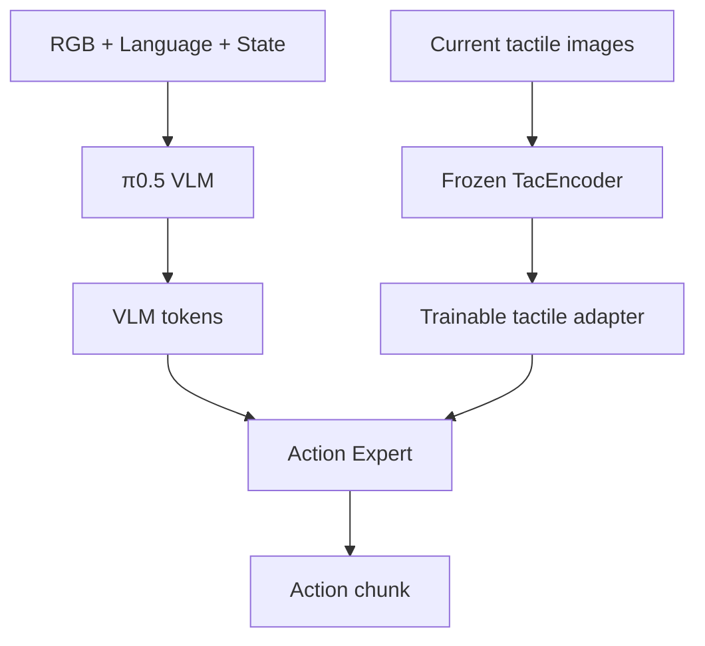
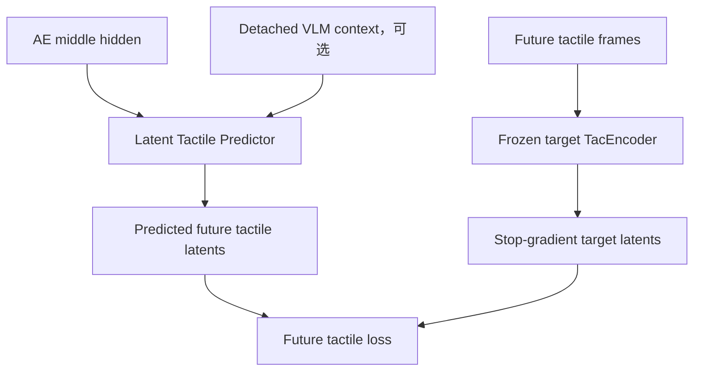
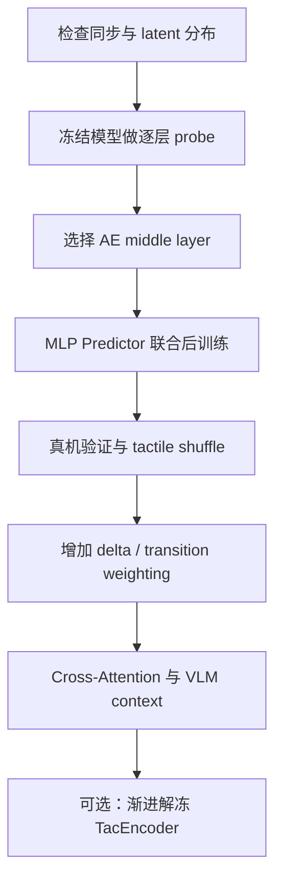

# 基于未来触觉表征预测的 π0.5 VTLA 后训练方案

> 文档定位：面向当前 `π0.5 + physics-pretrained TacEncoder` 系统的研究与工程实施方案。目标不是从零预训练一个通用 VTLA，而是利用任务级同步视觉—触觉轨迹，将已经预训练的 π0.5 高效后训练为真正依赖触觉的策略。
>
> 核心思想：让 Action Expert 不仅能够输出正确动作，还必须能够从其中间隐藏状态解释“当前动作意图将导致怎样的未来接触结果”。未来触觉预测仅作为训练阶段的辅助目标，不进入部署推理路径。

> **状态（2026-09-16）**：本稿为方法层面的通用草案，伪代码是 PyTorch 风格，不对应本仓库的 JAX 训练栈。
> 实施依据是 `docs/action-conditioned-tactile-pretraining.md`（第三版，从零开始的分步方案）。与本稿
> 的主要差别：那份先做 N0 式独立未来触觉预测器（只训编码器，可独立评测），零改动接入策略后用反事实
> 探针看 expert 用不用；本稿的"expert 中间层挂头"是那份的步骤 3a，只在接入后 expert 仍不读触觉时才上。
> 目标第一版用 16×16 像素场而非物理 latent；本机没有物理编码器 checkpoint，且它是随机初始化 + 仿真
> 数据训练，不作冻结当前分支。

---

## 1. 结论先行

当前最推荐的训练范式是：

```text
Pretrained π0.5
        +
Physics-pretrained TacEncoder
        +
Random-init tactile adapter / predictor
        ↓
Task-level synchronized visual–tactile demonstrations
        ↓
Joint post-training
```

不需要先单独训练一个大规模 Tactile Predictor，也不需要先收集数百小时数据做通用 tactile-VLA pretraining。第一版可直接使用带同步触觉的任务数据，联合优化：

\[
\mathcal L_{total}
=
\mathcal L_{action}
+
\lambda_{tac}\mathcal L_{future\_tactile}.
\]

各模块的初始化与训练建议如下。

| 模块 | 初始化 | 第一阶段是否训练 | 说明 |
|---|---|---:|---|
| π0.5 VLM | 预训练权重 | 冻结或 LoRA | 优先保护视觉—语言语义能力 |
| Action Expert | 预训练权重 | 是 | 同时接受动作损失和未来触觉损失 |
| TacEncoder | 物理多任务预训练权重 | 冻结 | 提供稳定的触觉物理 latent space |
| Tactile Adapter | 随机初始化 | 是 | 将 TacEncoder 输出映射为 AE 可用 token |
| Latent Tactile Predictor | 随机初始化 | 是 | 只在训练阶段使用 |
| Future target TacEncoder | 与 TacEncoder 相同的冻结副本 | 否 | 产生 stop-gradient 的未来触觉目标 |

第一版成功后，再考虑解冻 TacEncoder 后几层、增加 VLM context、使用 EMA target encoder 或进行多任务大规模预训练。

---

## 2. 研究问题与方法定位

### 2.1 当前问题

在现有 VTLA 中，仅把触觉 token 拼入 Action Expert，并不能保证策略真正利用触觉。模型可能主要依赖 RGB、语言和机器人状态完成行为克隆；触觉输入即使存在，也可能被注意力层忽略，甚至对动作产生噪声干扰。

这一问题在以下情形尤其明显：

- 训练集中的视觉状态与动作高度相关；
- 不同轨迹的接触模式变化不足；
- 触觉 adapter 的初始尺度与原有 token 不匹配；
- 动作损失可以在不读取触觉的情况下快速下降；
- 触觉编码器与 VLA 同时从少量数据中训练，导致表示不稳定。

### 2.2 方法目标

在 Action Expert 的中间层增加一个仅训练时存在的 Latent Tactile Predictor（LTP），预测多个未来时刻的触觉 latent：

\[
\hat z^{tac}_{t+k}
=
P_\phi\!\left(h_{AE,t}^{(m)}\right),
\qquad k\in\mathcal K,
\]

其中：

- \(h_{AE,t}^{(m)}\) 是 Action Expert 第 \(m\) 个中间层的隐藏状态；
- \(P_\phi\) 是轻量预测器；
- \(\mathcal K\) 是稀疏未来时间点集合，如 \(\{10,20,30,40,50\}\)；
- 目标 latent 来自冻结的 TacEncoder：

\[
z^{tac}_{t+k}
=
\operatorname{sg}\!\left(E_{tac}(T_{t+k})\right).
\]

这里的 `sg` 表示 stop-gradient。

### 2.3 它不是什么

该方法不是 MPC，也不在推理时根据预测触觉重新规划动作；它也不是给策略输出显式叠加残差：

\[
a' = a + \Delta a.
\]

它属于 representation shaping：未来触觉损失通过 AE 中间层反向传播，使动作表示同时包含运动意图与接触后果。

---

## 3. 总体架构

### 3.1 主策略路径

推理阶段保留的主路径为：



数学形式为：

\[
a_{t:t+H}
=
\pi_\theta
\left(I_t,L,s_t,E_{tac}(T_t)\right).
\]

注意：删除的是训练辅助用的 Tactile Predictor，而不是当前触觉的 TacEncoder。部署时 current tactile 仍必须进入策略。

### 3.2 训练辅助路径



正式版本可写为：

\[
\hat Z^{tac}_{future}
=
P_\phi
\left(
h_{AE}^{(m)},
\operatorname{sg}(h_{VLM}^{last})
\right).
\]

但第一版应先只使用 \(h_{AE}^{(m)}\)，避免额外结构掩盖核心结论。

### 3.3 梯度流

| 损失 | Predictor | Tactile Adapter | AE 前半部分 | AE 后半部分 | TacEncoder | VLM |
|---|---:|---:|---:|---:|---:|---:|
| \(\mathcal L_{action}\) | 否 | 是 | 是 | 是 | 第一版否 | 按配置 |
| \(\mathcal L_{tac}\) | 是 | 是 | 是，直至分叉层 | 否或极少 | 第一版否 | 否，若使用 context 必须 detach |

如果 Predictor 从 AE 第 \(m\) 层分叉，触觉损失主要更新该层及其之前的模块，不直接更新分叉之后的 AE 层。这正是选取中间层而非最终动作输出的原因。

---

## 4. 为什么优先预测 latent，而非触觉 RGB

视觉触觉图像中包含大量与控制无关或弱相关的细节，例如照明、marker 外观、凝胶色差、相机噪声和传感器个体偏差。直接重建未来图像会让模型把容量用于像素细节，而不是接触动力学。

当前物理预训练的 TacEncoder 已通过深度、marker flow、低分辨率 bottleneck 等监督学习形变与局部几何信息，因此更适合作为预测目标。目标由“未来触觉图像长什么样”转化为“未来物理接触状态是什么”。

第一版建议使用 TacEncoder 的 pooled latent 或固定的 token latent，并在训练前统计其数值尺度：

- 每维均值与标准差；
- 样本间 cosine similarity；
- 接触/非接触样本的 latent 距离；
- 不同传感器通道的分布差异。

必要时对 target latent 做固定标准化：

\[
\tilde z = \frac{z-\mu_{train}}{\sigma_{train}+\epsilon}.
\]

其中 \(\mu_{train}\) 和 \(\sigma_{train}\) 只从训练集计算，并在验证与部署分析时固定。

---

## 5. 数据设计

### 5.1 单个训练样本

每条轨迹至少包含严格同步的：

\[
\left(I_t,L,s_t,T_t,a_t\right).
\]

用于 action chunk 与 multi-horizon prediction 的样本应组织为：

\[
\left(
I_t,L,s_t,T_t,
a_{t:t+H},
T_{t+k_1},\ldots,T_{t+k_K}
\right).
\]

建议第一版采用：

- action horizon：\(H=50\)；
- future horizons：\(\mathcal K=\{10,20,30,40,50\}\)；
- 如果原始数据为 30 Hz，对应约 0.33、0.67、1.00、1.33、1.67 秒；
- 若策略训练或回放频率并非 30 Hz，必须按策略时间基准重新定义，而不能直接沿用帧编号。

### 5.2 轨迹尾部处理

当 \(t+k\) 超出 episode 尾部时，不建议简单重复最后一帧作为所有未来目标，否则会人为增加大量静态目标。建议为每个 horizon 保存有效掩码：

\[
m_{t,k}=\mathbb 1[t+k<T_{episode}].
\]

损失只对有效目标计算：

\[
\mathcal L_{tac}
=
\frac{
\sum_{t,k}m_{t,k}\ell_{t,k}
}{
\sum_{t,k}m_{t,k}+\epsilon
}.
\]

### 5.3 多传感器组织

若有 \(M\) 路触觉传感器，可使用两种方式：

1. **独立编码后拼接**：每路共享 TacEncoder，输出分别经过 adapter，再按传感器顺序拼接 token；
2. **独立预测头**：共享 Predictor trunk，每个传感器有单独输出 head，可避免不同触觉视角分布互相干扰。

第一版推荐独立编码、固定顺序、共享权重，并显式加入 `sensor_id embedding`。不得在数据加载时随机改变各触觉通道顺序。

### 5.4 数据内容比纯数量更重要

未来触觉预测最需要的是“视觉相近，但接触不同，正确动作也不同”的样本。例如插接任务应覆盖：

| 接触状态 | 期望行为 |
|---|---|
| 左侧接触增强 | 向右微调或退回重对齐 |
| 右侧接触增强 | 向左微调或退回重对齐 |
| 正面阻塞 | 停止前进，回退并重新搜索 |
| 接触突然减弱 | 判断滑脱、脱离或成功进入 |
| 无接触且视觉已对齐 | 继续推进 |

如果所有轨迹都从相同初始位置、以几乎相同动作完成，模型可能仅靠 RGB 与 action 隐含信息预测 future tactile，仍然忽略 current tactile。

### 5.5 数据划分

必须按 episode 划分 train/validation/test，不能随机拆帧。建议：

- 训练集：70%–80% episodes；
- 验证集：10%–15% episodes；
- 离线测试集：10%–15% episodes；
- 真机测试：使用训练中未出现的初始偏差与接触扰动。

最好额外建立一个 contact-focused validation subset，只包含接触建立、滑移、阻塞、释放等窗口，以避免大量无接触帧让平均指标虚高。

---

## 6. 模型模块设计

### 6.1 TacEncoder 与 Tactile Adapter

当前可沿用物理多任务预训练的 FastViT TacEncoder。第一阶段冻结其全部参数，只训练 adapter：

```python
with torch.no_grad():
    tac_feat = tactile_encoder(tactile_images)

tac_tokens = tactile_adapter(tac_feat)
```

adapter 推荐使用：

```text
LayerNorm
→ Linear(D_tac, D_AE)
→ GELU
→ Linear(D_AE, N_tac_tokens × D_AE)
→ reshape
```

如果 TacEncoder 输出为 \((B,1024)\)，AE embedding dim 为 \(D_{AE}\)，则：

```text
input:  (B, M, 1024)
output: (B, M × N_tac_tokens, D_AE)
```

建议从每个传感器 1–4 个 token 开始，而不是直接把高分辨率 feature map 全部送入 AE。

### 6.2 Hidden-state tap

Action Expert forward 需要支持返回指定层 hidden：

```python
action_out, hidden = action_expert(
    inputs,
    return_hidden_states=True,
    tap_layer=tap_layer,
)

h_mid = hidden[tap_layer]
```

必须确认返回的是：

- 该层更新后的 hidden；
- 只包含 action/expert token，还是包含完整联合序列；
- padding token 是否已通过 attention mask 排除；
- RTC、非 RTC 训练时 token 布局是否一致。

用于 predictor 的 pooling 不应混入无效 padding token。

### 6.3 Predictor：MVP 版本

第一版使用 pooled hidden + MLP：

\[
c_t=\operatorname{MaskedPool}\left(h_{AE,t}^{(m)}\right),
\]

\[
\hat Z_t
=
\operatorname{reshape}
\left(\operatorname{MLP}(c_t)\right)
\in \mathbb R^{K\times M\times D_{tac}}.
\]

推荐结构：

```text
LayerNorm(D_AE)
→ Linear(D_AE, 2D_AE)
→ GELU
→ Dropout(0.1)
→ Linear(2D_AE, K × M × D_tac)
```

该版本便于快速验证 layer choice 与梯度流，且参数量容易控制。

### 6.4 Predictor：正式 Cross-Attention 版本

若 MVP 有效，再引入每个 horizon 一个 learnable query：

\[
Q=[q_{k_1},\ldots,q_{k_K}],
\]

\[
U=\operatorname{CrossAttn}(Q,h_{AE}^{(m)},h_{AE}^{(m)}),
\]

\[
\hat z_{t+k}=W_oU_k.
\]

优点是保留 AE token 结构，不要求所有信息压缩为单个 pooled vector。若增加 VLM context，可先让 query 以 AE hidden 为主要 K/V，再用 detached VLM context 做第二层 cross-attention 或 FiLM conditioning。

### 6.5 VLM context 的使用原则

第一版不使用 VLM context。只有当层探针和 MVP 证明 AE-middle 是有效来源后，才测试：

\[
P\left(h_{AE}^{(m)},\operatorname{sg}(h_{VLM}^{last})\right).
\]

必须显式：

```python
h_vlm_aux = h_vlm_last.detach()
```

否则触觉辅助损失会修改 VLM 的语义表示，少量任务数据可能导致过拟合并破坏原有视觉—语言能力。

---

## 7. 损失函数

### 7.1 基础 latent regression loss

建议在标准化 latent 上使用 Smooth L1 或 cosine + Smooth L1，而不是只用未归一化 MSE：

\[
\mathcal L_{abs}
=
\frac{1}{KM}
\sum_{k,m}
\operatorname{SmoothL1}
\left(
\hat z_{t+k}^{(m)},
\operatorname{sg}(z_{t+k}^{(m)})
\right).
\]

可增加方向一致性项：

\[
\mathcal L_{cos}
=
1-cos\left(\hat z,z\right).
\]

第一版：

\[
\mathcal L_{future}
=
\mathcal L_{abs}+0.1\mathcal L_{cos}.
\]

### 7.2 触觉变化预测

为了减少 predictor 只依赖视觉与动作的 shortcut，可同时预测相对当前触觉的变化：

\[
\Delta z_{t,k}=z_{t+k}-z_t,
\]

\[
\mathcal L_{delta}
=
\left\|
\widehat{\Delta z}_{t,k}
-
\operatorname{sg}(z_{t+k}-z_t)
\right\|.
\]

组合为：

\[
\mathcal L_{tac}
=
\mathcal L_{future}
+
\beta\mathcal L_{delta}.
\]

建议先令 \(\beta=0\) 跑通 MVP，再尝试 \(0.25\) 或 \(0.5\)。

### 7.3 Contact-transition weighting

大量静态无接触帧会让 predictor 通过输出平均 latent 获得较低 loss。可依据 latent 变化设置权重：

\[
d_{t,k}=\left\|z_{t+k}-z_t\right\|_2,
\]

\[
w_{t,k}=\operatorname{clip}
\left(1+\alpha d_{t,k},1,w_{max}\right).
\]

最终：

\[
\mathcal L_{tac}
=
\frac{\sum_{t,k}m_{t,k}w_{t,k}\ell_{t,k}}
{\sum_{t,k}m_{t,k}w_{t,k}+\epsilon}.
\]

建议先统计 \(d_{t,k}\) 分布，再以分位数确定权重，而不是直接猜绝对阈值。

### 7.4 总损失与权重调度

\[
\mathcal L_{total}
=
\mathcal L_{\pi0.5}
+
\lambda_{tac}(u)\mathcal L_{tac},
\]

其中 \(u\) 为训练 step。建议使用短 warm-up：

\[
\lambda_{tac}(u)
=
\lambda_{max}
\min\left(1,\frac{u}{u_{warmup}}\right).
\]

默认起点：

- \(\lambda_{max}\in\{0.05,0.1,0.25\}\)；
- \(u_{warmup}\) 为总训练步数的 5%–10%；
- 目标不是让两个 raw loss 数值相等，而是使二者对 AE 共享参数的梯度量级可比且不破坏 action learning。

应定期记录：

\[
r_g
=
\frac{
\left\|\nabla_{\theta_{shared}}\lambda_{tac}\mathcal L_{tac}\right\|_2
}{
\left\|\nabla_{\theta_{shared}}\mathcal L_{action}\right\|_2+\epsilon
}.
\]

建议初期把 \(r_g\) 控制在约 0.1–0.5；若远大于 1，辅助任务可能主导训练。

---

## 8. 训练前的层探针实验

在修改主训练链路前，先冻结 π0.5 与 TacEncoder，逐层训练轻量 linear/MLP probe。这一步回答最关键的问题：未来触觉可预测信息集中在哪一层。

### 8.1 候选输入

- `h_vlm_last`；
- Action Expert 各候选中间层；
- Action Expert 最后一层；
- 最终 predicted action chunk；
- 可选：`h_AE_middle + detached h_vlm_last`。

### 8.2 控制变量

- 所有 probe 使用相同训练/验证 episode 划分；
- 相同参数量或至少报告参数量；
- 相同 target latent、归一化方式、horizons 和优化器；
- backbone 全冻结；
- 同时报告 all-frame 与 contact-focused 指标。

### 8.3 指标

| 指标 | 作用 |
|---|---|
| Future latent Smooth L1/MSE | 基本预测精度 |
| Cosine similarity | 表征方向一致性 |
| Contact-transition subset error | 接触变化阶段是否可预测 |
| Horizon-wise error | 信息随时间跨度如何衰减 |
| Current-tactile shuffle degradation | 输入触觉是否真的被使用 |

最后一项非常关键：在验证集随机打乱 current tactile，但保持 RGB、state、language 不变。如果误差几乎不变，说明 probe 主要依赖视觉或动作相关信息。

### 8.4 层选择规则

不要只选总体 MSE 最低的层。优先选择：

1. contact-focused error 较低；
2. shuffle current tactile 后性能明显下降；
3. 中长期 horizon 仍有可预测性；
4. 该层接入 predictor 后不会显著增加显存和通信开销。

---

## 9. 分阶段训练路线

### Stage 0：数据与表示验证

目标：确认时间同步、latent 分布和目标构造正确。

检查项：

- RGB、action、state、tactile 时间戳对齐；
- horizon 对应真实时间正确；
- 轨迹尾部 mask 正确；
- TacEncoder 对接触变化有响应；
- future target 已 detach；
- episode-level split 无泄漏。

### Stage 1：冻结模型的层探针

目标：确定 predictor 最合适的分叉层，并建立“仅凭表示能否预测 future tactile”的离线证据。

训练内容：仅 probe。

验收：至少某个 AE 中间层优于 VLM last、AE final 或 action-only baseline，且触觉 shuffle 会造成可见退化。

### Stage 2：最小联合后训练（MVP）

结构：

- frozen TacEncoder；
- trainable tactile adapter；
- trainable AE；
- frozen VLM 或 VLM LoRA；
- pooled AE-middle + MLP predictor；
- 只用 absolute future latent loss；
- 不使用 VLM context、delta loss 和 transition weighting。

目标：先证明辅助损失能提高真机接触任务表现，而不损害基本动作质量。

### Stage 3：防 shortcut

依次添加，而不是同时添加：

1. delta latent prediction；
2. contact-transition weighting；
3. current tactile shuffle/counterfactual 训练或诊断；
4. tactile dropout，且显式提供 unavailable mask。

每次只改变一个因素，验证是否真正提升触觉依赖性。

### Stage 4：正式 Predictor

将 pooled MLP 替换为 horizon-query cross-attention。若 detached VLM context 能稳定降低接触阶段误差并提升真机成功率，再保留它；否则使用更简洁的 AE-middle-only 版本。

### Stage 5：渐进解冻

只有 Stage 2–4 已证明有效后才进行：

- 解冻 TacEncoder 最后一个 stage；
- current branch 使用可训练 encoder；
- target branch 保持 frozen copy 或 EMA teacher；
- TacEncoder 学习率设为 AE 学习率的 0.05–0.2 倍；
- 监控 latent 方差与 pairwise distance，防止 collapse。

这属于 progressive post-training，不是第一版的必要条件。

---

## 10. 推荐的 MVP 配置

下面的数值是适合开始网格搜索的默认值，不应被当作最终最优参数。

```yaml
model:
  base_policy: pi05
  action_horizon: 50
  tactile:
    encoder: pretrained_fastvit
    encoder_frozen: true
    latent_dim: 1024
    tokens_per_sensor: 2
    add_sensor_id_embedding: true
  tactile_predictor:
    enabled: true
    train_only: true
    type: pooled_mlp
    tap_layer: probe_selected_layer
    future_offsets: [10, 20, 30, 40, 50]
    predict_delta: false
    use_vlm_context: false

loss:
  action_weight: 1.0
  tactile_weight: 0.1
  tactile_weight_warmup_ratio: 0.1
  tactile_type: smooth_l1_cosine
  cosine_weight: 0.1
  delta_weight: 0.0
  transition_weighting: false

optimization:
  vlm_train_mode: frozen
  action_expert_trainable: true
  tactile_adapter_trainable: true
  tactile_predictor_trainable: true
  grad_clip_norm: 1.0
  mixed_precision: bfloat16

logging:
  log_horizon_metrics: true
  log_contact_subset_metrics: true
  log_gradient_ratio: true
  log_tactile_shuffle_eval: true
```

建议优先搜索：

- `tactile_weight`: 0.05 / 0.1 / 0.25；
- `tap_layer`: probe 排名前 2–3 的层；
- `tokens_per_sensor`: 1 / 2 / 4；
- `future_offsets`: `[10, 30, 50]` 与 `[10, 20, 30, 40, 50]`。

不要在第一轮同时搜索 encoder 解冻、VLM context、delta loss、cross-attention 和多个 loss 权重，否则无法判断收益来源。

---

## 11. 训练 step 伪代码

```python
def training_step(batch, model, tactile_encoder, predictor, cfg):
    # 1. 当前触觉编码：第一阶段 encoder 冻结
    with torch.no_grad():
        z_current = tactile_encoder(batch.tactile_current)

    tactile_tokens = model.tactile_adapter(z_current)

    # 2. 正常 π0.5 / VTLA 前向，返回被选中的 AE 中间层
    policy_out = model.forward_policy(
        images=batch.images,
        language=batch.language,
        state=batch.state,
        tactile_tokens=tactile_tokens,
        actions=batch.actions,
        return_ae_hidden=True,
        tap_layer=cfg.tap_layer,
    )

    action_loss = policy_out.action_loss
    h_mid = policy_out.ae_hidden

    # 3. 未来触觉目标：必须 frozen + no_grad/stop-gradient
    with torch.no_grad():
        z_future = tactile_encoder(batch.tactile_future)
        z_future = normalize_with_train_stats(z_future)

    # 4. 预测多个 future horizons
    pred = predictor(
        h_mid=h_mid,
        hidden_mask=policy_out.ae_hidden_mask,
    )

    tactile_loss = masked_future_tactile_loss(
        pred=pred,
        target=z_future,
        horizon_mask=batch.future_valid_mask,
        current=z_current,
        cfg=cfg.loss,
    )

    # 5. 辅助损失短 warm-up
    lambda_tac = tactile_weight_schedule(global_step, cfg)
    total_loss = action_loss + lambda_tac * tactile_loss

    return {
        "loss": total_loss,
        "action_loss": action_loss.detach(),
        "tactile_loss": tactile_loss.detach(),
        "lambda_tac": lambda_tac,
    }
```

必须写单元测试确认：

- `z_future.requires_grad == False`；
- `h_vlm_aux.requires_grad == False`（若启用 VLM context）；
- Predictor 在 `model.eval()` 的部署路径中完全不被调用；
- 关闭 tactile loss 后，前向输出与原 VTLA 基线一致；
- RTC 与非 RTC 配置下 tap 到的 token 区间和 mask 正确。

---

## 12. 消融实验矩阵

### 12.1 必做主消融

| 编号 | 当前触觉输入 | Future predictor | 分叉位置 | 用途 |
|---|---:|---:|---|---|
| A | 否 | 否 | — | 纯视觉 π0.5 基线 |
| B | 是 | 否 | — | 直接触觉条件化 VTLA |
| C | 是 | 是 | VLM last | 验证感知表示分叉 |
| D | 是 | 是 | AE final | 验证过晚分叉 |
| E | 是 | 是 | AE middle | 核心方案 |
| F | 是 | 是 | AE middle + detached VLM | 验证语义 context 增益 |

### 12.2 触觉依赖性诊断

在同一 checkpoint 上进行：

- 正常 tactile；
- 全零 tactile；
- 时间错位 tactile；
- episode 内随机 shuffle tactile；
- 左右/不同传感器通道交换；
- 只保留 tactile、遮挡部分视觉（仅诊断，不代表正常部署）。

如果正常 tactile 与错误 tactile 的动作和成功率几乎相同，不能仅凭训练 loss 下降宣称策略使用了触觉。

### 12.3 预测目标消融

| 方案 | 目标 |
|---|---|
| Absolute only | \(z_{t+k}\) |
| Delta only | \(z_{t+k}-z_t\) |
| Absolute + Delta | 两者联合 |
| Raw tactile image | 像素重建对照，不推荐作为主方案 |
| Physics latent | 当前核心方案 |

### 12.4 Encoder 消融

- ImageNet 初始化 TacEncoder；
- SimMIM/VAE TacEncoder；
- 当前 physics-pretrained TacEncoder；
- physics-pretrained + frozen；
- physics-pretrained + last-stage unfrozen；
- current trainable + target EMA。

这组实验能够直接连接你已有的 TacEncoder 线性探针结果与 VTLA 控制表现。

---

## 13. 评测方案

### 13.1 离线指标

- 原 action/flow-matching loss；
- future tactile loss，分 horizon 报告；
- contact-focused future tactile loss；
- normal vs shuffled tactile 的预测误差差值；
- 动作对 tactile 扰动的敏感度；
- AE hidden 与 future tactile latent 的 linear probe 指标；
- gradient ratio 与 hidden/latent 方差。

### 13.2 真机任务指标

以插接为例，至少报告：

- 完整任务成功率；
- 首次对准成功率；
- 平均完成时间；
- 最大接触力或可替代的触觉强度峰值；
- 阻塞后的恢复率；
- 需要人工接管的比例；
- 正常条件与视觉遮挡/位置扰动/接触扰动下的结果。

### 13.3 成功标准

第一阶段不应只以 predictor loss 下降为成功。建议至少满足：

1. AE-middle probe 在 contact-focused subset 上优于 VLM/final-action baseline；
2. shuffle tactile 会显著降低 prediction 或 policy 性能；
3. 加入 LTP 后 action loss 不明显恶化；
4. 真机成功率或接触恢复能力高于“仅拼接 tactile token”的 VTLA；
5. 移除 Predictor 后部署速度与原 VTLA 基本一致。

---

## 14. 关键风险与处理方式

### 14.1 Predictor 忽略 current tactile

**现象**：打乱 current tactile 后 future prediction 基本不变。

**原因**：RGB、state 和动作意图足以预测平均接触结果。

**处理**：增加视觉相近但接触不同的数据；加入 delta prediction；提高 contact-transition 样本权重；使用 tactile shuffle 作为持续诊断。

### 14.2 静态无接触帧主导 loss

**现象**：总体 loss 很低，但接触建立或滑移阶段误差很高。

**处理**：单独报告 contact subset；对 contact transition 加权；对训练窗口做事件均衡采样。

### 14.3 辅助损失破坏动作学习

**现象**：tactile loss 下降，但 action loss 上升、真机动作变差。

**处理**：减小 \(\lambda_{tac}\)；增加 warm-up；监控共享参数梯度比；选择更靠后的合适 tap layer；先冻结 VLM。

### 14.4 Target latent collapse 或漂移

**现象**：latent 方差持续下降，predictor 很容易输出常数。

**处理**：第一版冻结 TacEncoder；后续使用 frozen/EMA target branch；监控每维方差与样本间距离。

### 14.5 时间对齐错误

**现象**：不同 horizon 的 loss 没有合理趋势，短 horizon 反而最差。

**处理**：检查传感器时间戳、动作下发延迟、相机/触觉 buffer；按真实 wall-clock 对齐，而非假设所有数据流同频。

### 14.6 训练—部署路径不一致

**现象**：训练时 predictor 或未来帧信息意外进入主策略，部署性能崩溃。

**处理**：未来触觉只用于 target 分支；部署导出明确删除 predictor；为 inference graph 写无未来输入测试。

### 14.7 RTC token 布局干扰 hidden tap

**现象**：RTC 与非 RTC 训练时 predictor 读到不同含义的 token，或包含历史 padding。

**处理**：显式返回 AE action-token mask；禁止依据硬编码 index 截取；日志记录 sampler、delay、历史前缀长度和有效 token 数。

---

## 15. 推荐工程改动清单

### 数据层

- 在 sample 中增加 `tactile_current`；
- 增加 `tactile_future[K, M, C, H, W]`；
- 增加 `future_valid_mask[K]`；
- 保存实际时间偏移而非只保存帧索引；
- episode-level split；
- 可选的 contact-event 标签或 latent-change 权重。

### 模型层

- TacEncoder 支持 frozen forward；
- Tactile Adapter 输出固定 token 数；
- Action Expert 支持 `return_hidden_states` 与 `tap_layer`；
- 增加 pooled MLP Predictor；
- 后续再增加 horizon-query cross-attention；
- Predictor 注册为 train-only module，推理路径不调用。

### 损失层

- masked multi-horizon latent loss；
- horizon-wise logging；
- 可选 delta loss；
- 可选 transition weighting；
- tactile-loss warm-up；
- 共享参数 gradient-ratio 诊断。

### 评测层

- frozen layer probe；
- current tactile shuffle；
- sensor swap / temporal shift；
- contact-focused subset；
- 真机接触扰动测试；
- Predictor 移除后的部署延迟测量。

---

## 16. 推荐执行顺序



建议按以下里程碑推进：

### Milestone 1：可预测性

产出逐层 probe 表格，确定未来触觉信息最集中的 AE 层，并证明 current tactile shuffle 会造成退化。

### Milestone 2：链路打通

完成 frozen TacEncoder、trainable adapter、AE-middle MLP Predictor 和联合 loss；训练、保存、恢复与部署均可运行。

### Milestone 3：真机收益

在同一数据、同一训练步数下，对比 vision-only、tactile-conditioned 和 tactile-conditioned + LTP 三种模型。

### Milestone 4：证明真正使用触觉

通过时序错位、通道交换、触觉遮挡与接触扰动实验，证明性能收益来自正确触觉，而不是额外参数或正则化。

### Milestone 5：正式方法

加入防 shortcut 设计和 cross-attention predictor，完成层位置、目标形式、encoder 初始化及冻结策略的系统消融。

---

## 17. 论文叙事建议

可以将方法定位为：

> **Tactile-aware post-training of a pretrained VLA through future-contact grounding.**

对应中文表述：

> 本方法利用任务级同步视觉—触觉示教，在无需大规模触觉—动作联合预训练的条件下，通过未来触觉 latent 预测将 Action Expert 的中间动作表示与未来接触后果对齐，从而把预训练 VLA 高效后训练为触觉感知策略。

论文核心问题不是“能否训练出一个准确的触觉世界模型”，而是：

1. 未来触觉信息在 π0.5 的哪一层最可预测？
2. 在该层施加触觉监督，是否比在 VLM 或最终动作表示上更有效？
3. 这种辅助监督是否能让策略真正使用 current tactile？
4. 任务级 tactile demonstrations 是否足以完成有效后训练？

与大规模 VTLA pretraining 的关系应表述为互补：大规模预训练有利于获得跨任务通用能力，但不是验证本方法的前置条件。当前路线的实际价值在于，以已有 π0.5 和物理预训练 TacEncoder 为起点，仅用任务级触觉数据完成低成本适配。

---

## 18. 最小实现的最终定义

第一版只实现下面这组功能：

```text
Pretrained π0.5
  ├─ VLM: frozen
  └─ Action Expert: trainable

Physics-pretrained TacEncoder
  └─ frozen for both current and future branches

Current tactile
  → TacEncoder
  → trainable adapter
  → Action Expert

AE selected middle hidden
  → trainable pooled MLP predictor
  → future tactile latents at [10, 20, 30, 40, 50]

Future tactile
  → frozen TacEncoder
  → stop-gradient targets

Total loss
  = π0.5 action loss
  + λ × masked future tactile latent loss
```

暂不加入：

- VLM context；
- TacEncoder 解冻；
- EMA teacher；
- raw tactile reconstruction；
- tactile world-model rollout；
- 推理时 predictor；
- 多种 shortcut 防御同时叠加。

这个最小版本足以回答方法是否成立。若它不能在严谨的 layer probe、触觉 shuffle 和真机对照中显示收益，增加复杂结构通常只会让问题更难定位。

---

## 19. 参考资料

1. [Representation-Aligned Tactile Grounding for Contact-Rich Robotic Manipulation](https://arxiv.org/abs/2607.14609)：通过 layer probe 选择 Action Expert 中间表示，并使用轻量 Latent Tactile Predictor 预测未来触觉 embedding，是本方案“先选层、再施加 future tactile grounding”的直接参考。
2. [τ: Learning Touch-Augmented Vision-Language-Action Models from Future Visual Supervision](https://arxiv.org/abs/2607.24485)：从预训练 VLA 出发，结合任务级触觉数据与预测式辅助监督，支持“不依赖大型 tactile-VLA 预训练也可进行后训练”的路线。
3. [STAR: Sparse Tactile Representation Learning in Vision-Tactile-Language-Action Models for Dexterous Manipulation](https://arxiv.org/abs/2609.12549)：代表具有大规模视觉—触觉联合预训练数据时的另一条路线；其 200 小时、10,576 条轨迹、65 个任务的设置更适合通用 VTLA 预训练，不是本项目第一阶段的必要条件。
4. [Sparsh: Self-supervised Touch Representations for Vision-based Tactile Sensing](https://arxiv.org/abs/2410.24090)：触觉表征预训练与 latent-space learning 的参考，用于理解为何稳定、紧凑的触觉表示通常优于直接依赖原始像素。

---

## 20. 一句话总结

> 以预训练 π0.5 和冻结的物理触觉编码器为起点，使用任务级同步触觉轨迹联合训练动作损失与多时间尺度未来触觉 latent 损失，让 Action Expert 的中间隐藏状态同时表达“要做什么动作”和“该动作将产生什么接触后果”，训练完成后移除 Predictor，仅保留原 VTLA 主路径进行实时推理。
